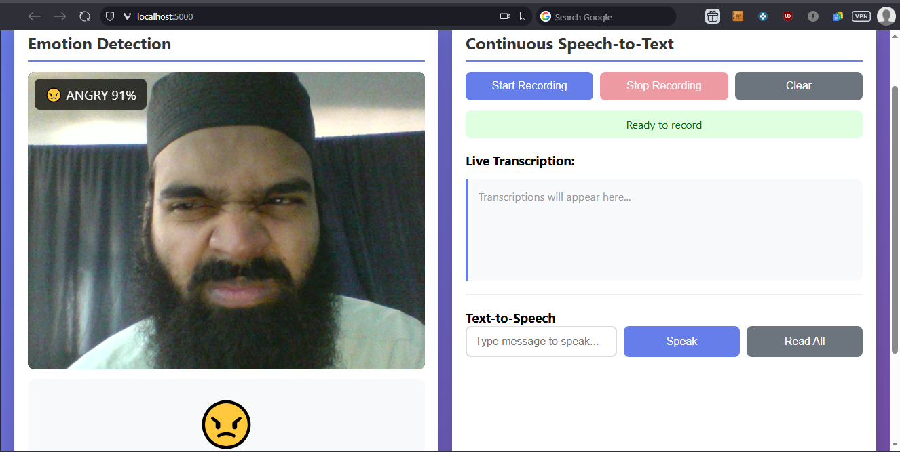
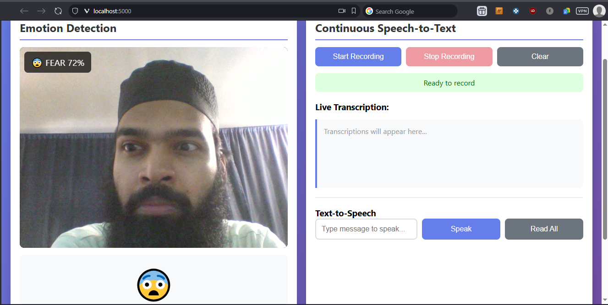
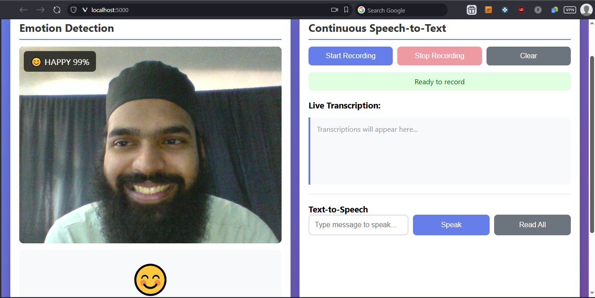
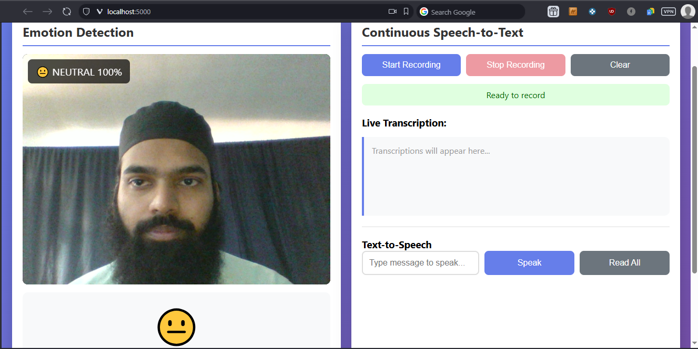
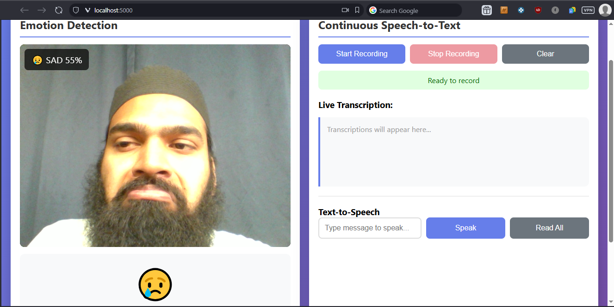
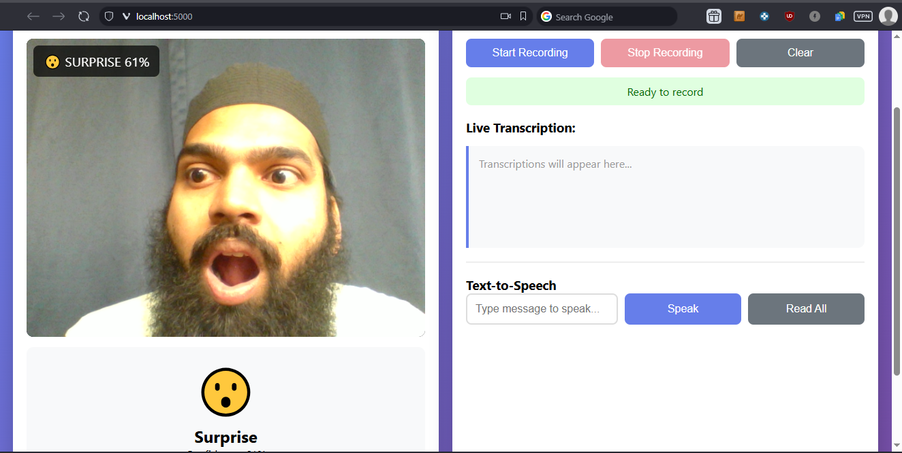
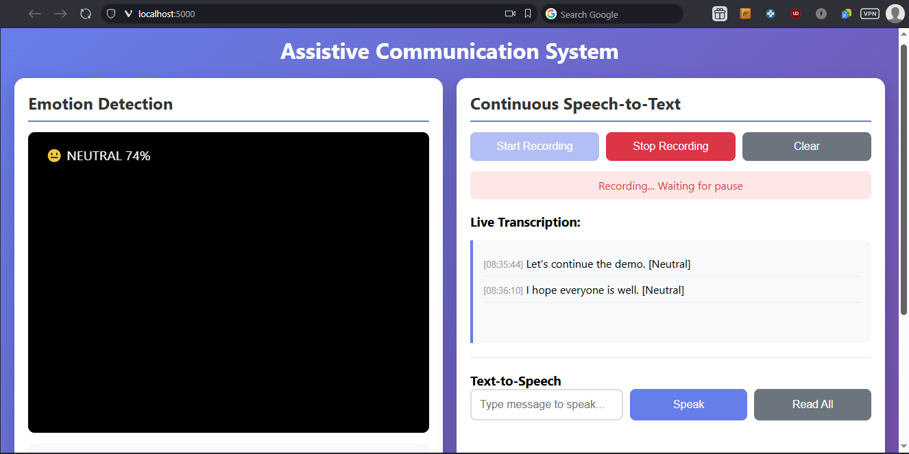
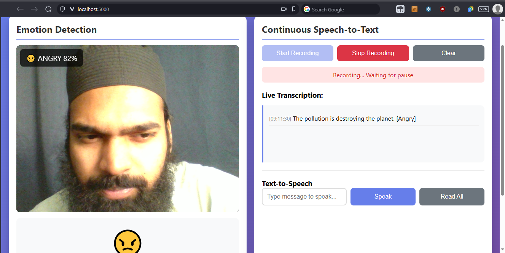
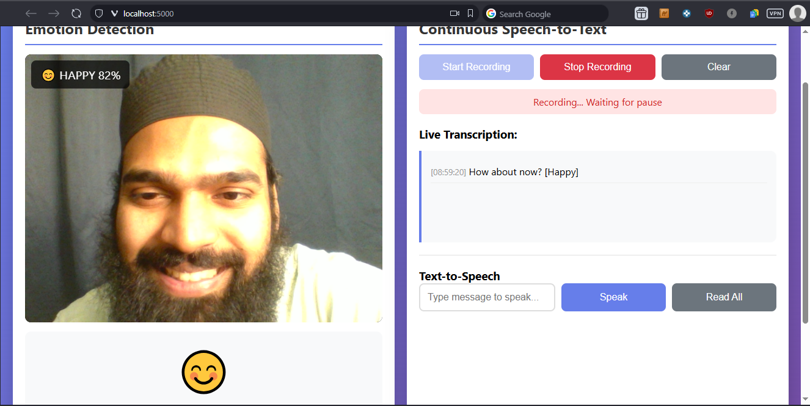
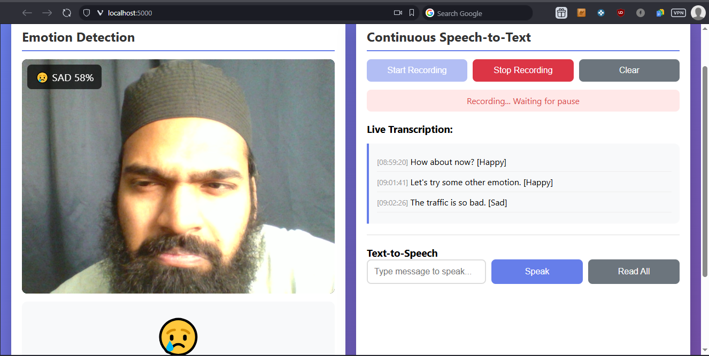

# Assistive Communication System

A real-time assistive communication application that combines emotion detection with speech-to-text transcription.

## Demo

### Emotion Detection







### Speech-To-Text Output





## Features

- **Real-time Emotion Detection**: Uses webcam to detect facial emotions (happy, sad, angry, surprise, fear, disgust, neutral)
- **Live Speech-to-Text**: Continuous transcription using Whisper AI (runs locally, no internet required)
- **Emotion-Tagged Transcriptions**: Each transcription includes the detected emotion (e.g., "hello [Happy]")
- **Text-to-Speech**: Type or read all transcriptions aloud
- **WebSocket Communication**: Real-time updates without page refresh

## Software Stack

| Component | Technology |
|-----------|------------|
| Backend | Flask + Flask-SocketIO |
| Async Runtime | Eventlet |
| Emotion Detection | DeepFace (TensorFlow) |
| Speech Recognition | Faster-Whisper (local AI) |
| Text-to-Speech | pyttsx3 |
| Audio Processing | SciPy |
| Video Processing | OpenCV |
| Frontend | HTML5, JavaScript, Socket.IO |

## Prerequisites

- Python 3.8 or higher
- Webcam
- Microphone
- ~500MB disk space (for AI models)

## Installation

1. **Create a virtual environment (recommended)**:
   ```bash
   python -m venv venv

   # Windows
   venv\Scripts\activate

   # Linux/Mac
   source venv/bin/activate
   ```

2. **Install dependencies**:
   ```bash
   pip install -r requirements.txt
   ```

3. **First run will download AI models**:
   - Whisper "tiny" model (~75MB) - downloaded automatically
   - DeepFace emotion model - downloaded automatically

## Running the Application

You need to run **two terminals**:

### Terminal 1: Start the Transcription Server
```bash
python transcribe_server.py
```
Wait for the message: `Model loaded! Server ready.`

### Terminal 2: Start the Flask Application
```bash
python app.py
```

Then open your browser to: **http://localhost:5000**

## Usage

1. **Start Camera**: Click "Start Camera" to enable emotion detection
2. **Start Recording**: Click "Start Recording" to begin speech transcription
3. **Speak**: Talk naturally - transcriptions appear after brief pauses
4. **Read All**: Click "Read All" to hear all transcriptions spoken aloud
5. **Text-to-Speech**: Type custom text and click "Speak"

## Project Structure

```
final_project_app/
├── app.py                 # Main Flask application
├── transcribe_server.py   # Whisper transcription server
├── requirements.txt       # Python dependencies
├── README.md             # This file
├── templates/
│   └── index.html        # Web interface
└── demo/
    ├── angry.png        
    ├── fear.png        
    ├── happy.png        
    ├── neutral.png       
    ├── sad.png        
    ├── surprise.png    
    ├── stt_initial.png 
    ├── stt_angry.png   
    ├── stt_happy.png   
    └── stt_sad.png     
```

## Troubleshooting

**"Transcription server not running"**
- Make sure `transcribe_server.py` is running in a separate terminal

**Camera not working**
- Allow camera permissions in your browser
- Check if another application is using the camera

**No transcriptions appearing**
- Speak louder or closer to the microphone
- Check console for "Audio max amplitude" - should be >1000

**Slow first transcription**
- First run downloads the Whisper model (~75MB)
- Subsequent runs are faster

## Key Highlights

- Fully real-time multimodal system (audio + video)
- Uses local AI models (privacy-preserving, no cloud dependency)
- Emotion-aware transcription system
- Modular architecture with separate STT microservice
- Works entirely on CPU (optimized for low-resource systems)

## Future Improvements

- Upgrade to larger Whisper models for higher accuracy
- GPU acceleration support
- Add multilingual transcription
- Improve emotion detection with temporal smoothing
- Deploy as cloud-based application

## License

MIT License
